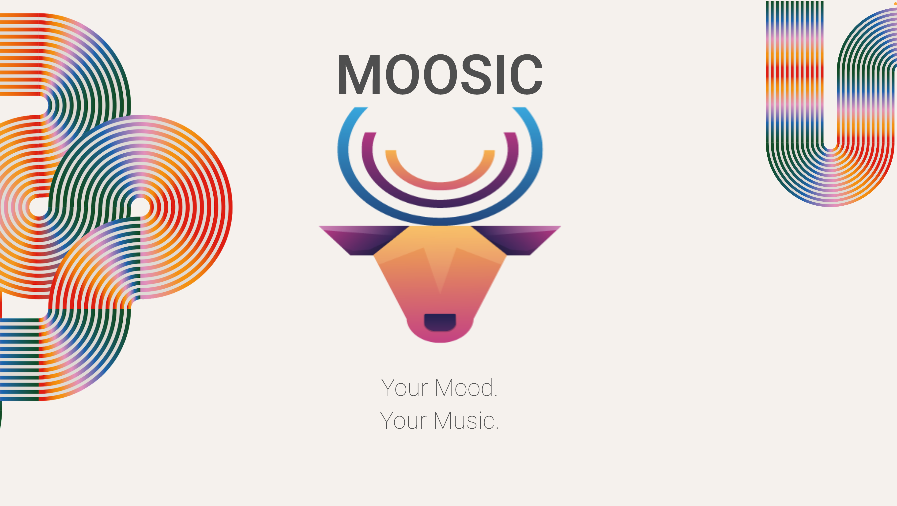
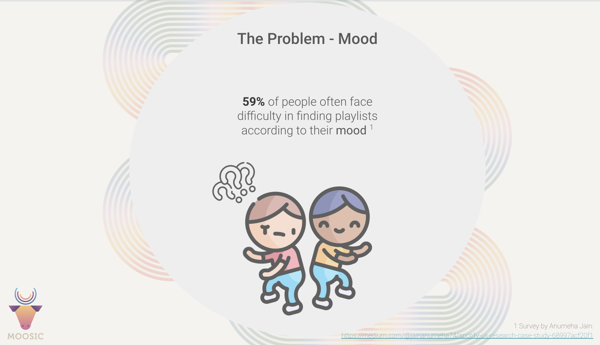

# DP Capstone Project 

## About MOOSIC : Your Music Mood Based Recommendation System

__Objective__ : In this repo we challenge ourselves for our as Data Practitioners to come up with a mood based recommendations system for music using Spotify track metadata to give users a better listening experience. Our goals were

* Moosic platform - To create an end-to-end content based (mood and music) personalised recommendation system.
* Mood preference - To create a music recommendation engine that allows users to select a mood goal. 
as a way to manage their mood based on their preference.
* Genre preference - To give the users the option to choose a genre so we can give diverse listeners diverse recommendations.
* Recommendations and experience - To prevent recommendations based on a dominant genre, repetitions and tracks that don’t fit the mood the users want to be in or achieve.


<br>


<div id="header" align="center">
  
</div>

<br>

### __Team__: __Rhythm Byte Engineers__

* Christian 
* Shahi 
* Grace 

<br>

---

###  __WHY MOOSIC? WHY MOOD?__

---
<br>

> How did we come up with this project idea and why music? What were our base reasons for developing MOOSIC? 

<br>

We are media - streaming lovers and we recognized the the importance of music for mood management and how it is an essential form of expression. We also talked about how unsatisfied we are with the music recommendations we get from Spotify or other music streaming platforms.

<br>

When we talked about why we don’t like the recommendations we figured out, that the same songs were proposed partly repeatedly or the tracks didn’t fit the mood we were in or the activity we were engaged in. By thinking of ways how to tackle these problems we came to the conclusion, that it would be nice to have some kind of user input, to make the track recommendations fit the user preferences. We then pinpointed the two features mood and genre to act as filters for better predictions. 


<br>


<div id="header" align="center">
  
</div>


<br>

---
---

<br>


> Why did we go with these two features mood and genre? Why is it important that music fits one's mood?

The problem with music recommendations at present is that the recommended tracks often times don’t fit the listeners mood and as humans, we continuously experience changes in our moods over the course of time - be it days or hours. Thus, tracking every individuals mood can be complex and affected by various underlying factors for instance social, cultural and situational or psychological factor that might not always be possible to assess based on their listening habits or that of other users alone. 

For example Spotify uses a complex system of a variety of factors to personalize the listening experience for each user. These factors include the user's listening history, their favorite songs and artists, and the genres and playlists they listen to. 

### __Mood management__ 

From time immemorial and across diverse cultures, music has always been used not only as a way to express emotions but also as a tool for managing our moods. 

Participants of a study,  conducted by British psychologists, responded that they use music to express emotions and manage their mood. Some reasons observed during the survey for why music was used were : 

* “To put them in the mood they want to be in”, - like feeling sad and wanting to feel better.
* “To get them into a certain mood or feel a certain way” 
* “To put them in a particular mood or get them out of a particular mood”
* “To put them in the mood for something” e.g. party, learning or working out etc.
* Reference Source: __Why do we listen to music? A uses and gratifications analysis by Adam J. Lonsdale and Adrian C. North, p.120. Published in: British Journal of Psychology (2011), 102, 108–134.__

<br>

### __Dominant vs Diverse Music Genre__  

Genre was also a key factor we considered because it was another problem encounter by us and other users when getting recommendations for music.

Aside from mood the Algorithm has Another problem: it can't make good song suggestions for people who like to listen to music from multiple genres. The result is that these users often only get song suggestions from their most dominant music genre. But they want to enjoy music from other genres as well and therefore demand - from a good recommendations engine - divers recommendations, as they are divers listeners. 

So, when we are sad on one day for example and listen extensively to sad songs, the algorithm is bound to recommend these songs again to the user, 
even if the user isn’t in a sad mood any more.

Source : [How Does the Spotify Algorithm work in 2023? The Spotify Algorithm Explained | iSpyTunes ](https://www.ispytunes.com/post/spotify-algorithm-explained)


<br>


<div id="header" align="center">
  
</div>


<br>


<br>


You will find __documentations__ of our thought processes, __mind maps__ from our brainstorming sessions, Jupyter Notebooks for our __EDAs__, our __recommendations system model__ and our final product (recommendations model) running in a __web application__.

<br>


## __Install environment:__

```bash
python -m venv .venv 
source .venv/bin/activate 
pip install --upgrade pip 
pip install -r requirements.txt 
```


<br>

## Overview of Project Structure

```bash

mood_music_recommendation_system/
│
├── data/
│   ├── raw_data/    # Raw data from source
│   │   ├── tracks_data.csv
│   │   ├── artists_data.csv
│   │   └── affect_lexicons.csv
│   │
│   └── processed_data/  # Processed data for recommendation
│       ├── embeddings/
│       │   ├── track_embeddings.pkl
│       │   ├── artist_embeddings.pkl
│       │   └── user_embeddings.pkl
│       │
│       ├── tracks_data.csv
│       ├── artist_data.csv
│       └── affect_lexicons.csv
│
├── documentation/
│   ├── moosic_brief_ideas.md          # Brainstorm and idea session - kickoff
│   ├── data_model_overview.md         # data description
│   ├── recommendation_engine.md        # 
│   ├── process_documents.md        # 
│   └── ... 
│
├── images/               # Images
│   ├── moosic_logo.png   
│   ├── data_model.png
│   └── ...
│
│
├── moosic_database (postgresql)/  # Data storage and database management
│   ├── moosic_database_init.sql   # Set up moosic database
│   ├── moodsic_queries.sql        # SQL queries
│   └── ...
│
├── moosic_recommendation_engine_src/ # Source files - notebooks, scripts
│   ├── notebooks/
│   │   ├── hypothesis_and_eda.ipynb
│   │   ├── feature_engineering.ipynb
│   │   ├── models.ipynb
│   │   └── hypothesis_and_eda.ipynb
│   │
│   └── src_scripts/
│       ├── eda_and_visualizations.py
│       ├── feature_engineering.py
│       ├── moosic_models.py
│       ├── utils.py
│       ├── tests.py
│       ├── sql_functions.py
│       └── moosic_webapp.py
│
│
├── services/                  # 
│   ├── nifi/                  # Data ingestion and migration
│   │   ├── nifi_flow_file.xml
│   │   ├── ...
│   │   └── ...
│   │
│   ├── airflow/         # Data workflow scheduling and orchestration for moosic
│   │   ├── dags/
│   │   │   └── moosic_workflow.py
│   │   │   
│   │   ├── airflow.cfg
│   │   └── ...
│   │
│   ├── kafka/               # Data streaming 
│   │   ├── ... 
│   │   └── ...
│   │
│   └── spark/
│      ├── ...
│      └── ...
│
├── ... 
├── docker-compose.yml   # Configuration file - services and their interactions
├── README.md            # About project
├── requirements.txt     # Dependencies file 
└── requirements_dev.txt # Dependencies file for dev
```


